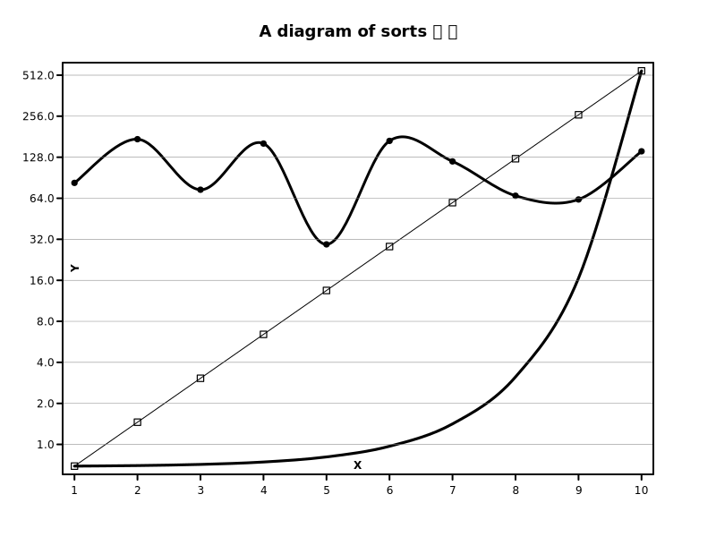

# Margaid ⇄ diagraM

The world surely doesn't need another plotting library.
But I did, and that's why Margaid was born.

Margaid is a small, no dependencies Golang library for plotting 2D data to SVG images. The idea is to create nice charts with a few lines of code and not having to bring in heavy machinery.

"Margaid" is an old name meaning "pearl", which seemed fitting for something shiny and small.
It's also the word "diagraM" spelled backwards.

## Features

Margaid plots series of data to an SVG image.
Plots are drawn using straight lines, smooth lines or bars.
Line plots can have data point markers.
Each axis has a fixed or automatic range, linear or log projection, configurable labels and optional grid lines.

Plot colors are automatically picked for each new plot, trying to spread them in hue and saturation to get a good mix.

There is no clever layout or layering going on. Each new command draws on top of the results from previous commands.

## Getting started

### Minimal example


These are the minimal steps needed to create a Margaid plot:
* Import the library
```go
import "github.com/erkkah/margaid"
```
* Create a series object and add some values
```go
series := margaid.NewSeries()
series.Add(margaid.MakeValue(10, 3.14), margaid.MakeValue(90, 93.8))
// et.c.
```

* Create the diagram object:
```go
diagram := margaid.New(800, 600)
```

* Plot the series
```go
diagram.Line(series)
```

* Add a frame and X axis
```go
diagram.Frame()
diagram.Axis(series, margaid.XAxis, diagram.ValueTicker('f', 2, 10), false, "Values")
```

* Render to stdout
```go
diagram.Render(os.Stdout)
```

### Example showing more features



To generate the diagram above from the code shown below:
```sh
> go run example/example.go > example.svg
```

```go
// example/example.go
package main

import (
    "math/rand"
    "os"
    "time"

    m "github.com/erkkah/margaid"
)

func main() {

    randomSeries := m.NewSeries()
    rand.Seed(time.Now().Unix())
    for i := float64(0); i < 10; i++ {
        randomSeries.Add(m.MakeValue(i+1, 200*rand.Float64()))
    }

    testSeries := m.NewSeries()
    multiplier := 2.1
    v := 0.33
    for i := float64(0); i < 10; i++ {
        v *= multiplier
        testSeries.Add(m.MakeValue(i+1, v))
    }

    diagram := m.New(800, 600,
        m.WithAutorange(m.XAxis, testSeries),
        m.WithAutorange(m.YAxis, testSeries),
        m.WithAutorange(m.Y2Axis, testSeries),
        m.WithProjection(m.YAxis, m.Log),
        m.WithInset(70),
        m.WithPadding(2),
        m.WithColorScheme(90),
    )

    diagram.Line(testSeries, m.UsingAxes(m.XAxis, m.YAxis), m.UsingMarker("square"))
    diagram.Smooth(testSeries, m.UsingAxes(m.XAxis, m.Y2Axis))
    diagram.Smooth(randomSeries, m.UsingAxes(m.XAxis, m.YAxis), m.UsingMarker("filled-circle"))
    diagram.Axis(testSeries, m.XAxis, diagram.ValueTicker('f', 0, 10), false, "X")
    diagram.Axis(testSeries, m.YAxis, diagram.ValueTicker('f', 1, 2), true, "Y")

    diagram.Frame()
    diagram.Title("A diagram of sorts 📊 📈")

    diagram.Render(os.Stdout)
}
```

## Documentation
For more details, check the [reference documentation](https://pkg.go.dev/github.com/erkkah/margaid).
